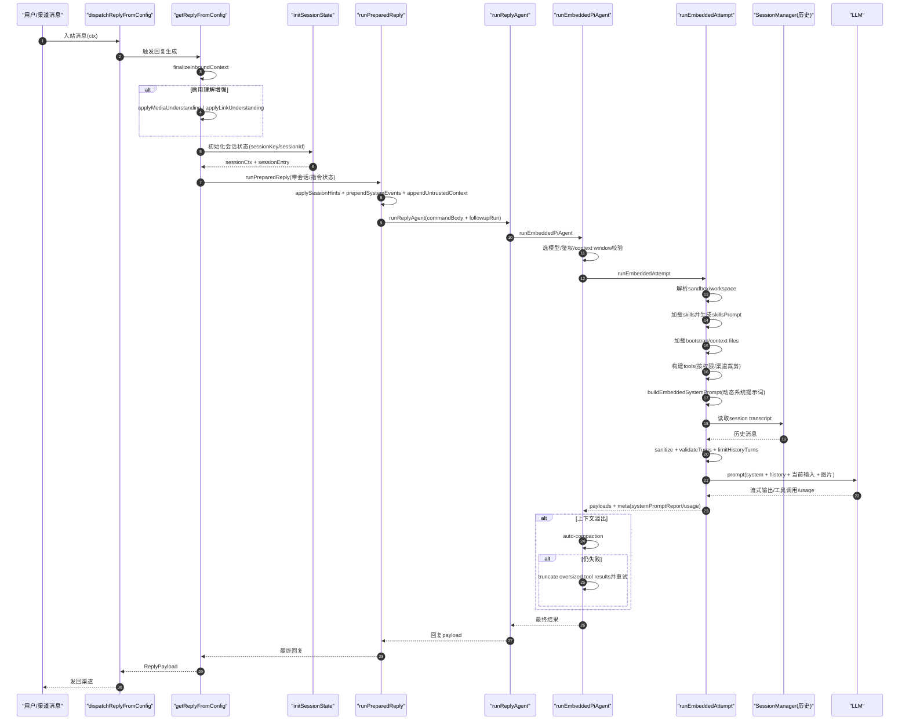
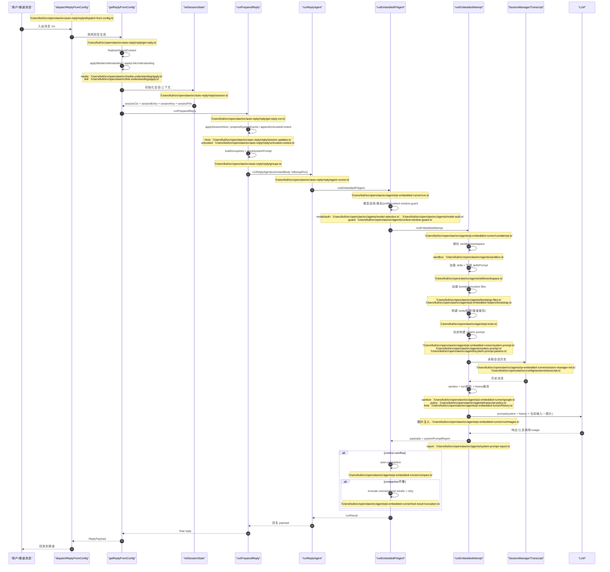

# OpenClaw Context 组装分析（完整整理）

本文整理了我们对 OpenClaw “为什么智能”以及 context 组装流程的完整分析，覆盖：

- 主执行链路
- 时序图（概念版 + 文件标注版）
- 具体请求如何被组装为 prompt（首轮）
- 用户继续追问时的组装变化（多轮）
- 三轮演化示例（含 `/model`、`/think`、工具调用）
- 调试 checklist（排查上下文问题）

---

## 1) 核心结论

OpenClaw 的“智能”不只是模型能力，而是 **context pipeline** 质量高：

1. 入站消息先做结构化归一（跨渠道统一字段）。
2. 会话状态先决（sessionKey/sessionId/sessionFile），先保证“历史是谁的”。
3. 当前输入会被叠加会话提示、系统事件、群聊上下文。
4. 每轮动态构建 system prompt（tools/skills/runtime/workspace/context files）。
5. 历史会按模型特性清洗/修复/裁剪，不是盲堆。
6. 运行中有自动恢复（context overflow -> compaction -> truncation -> retry）。

最终送模型的是三段：

- `system prompt`（动态构建）
- `history messages`（清洗后历史）
- `current user prompt`（本轮输入+增强）

---

## 2) 主执行链路（关键文件）

1. 入站分发  
`/Users/liuli/src/openclaw/src/auto-reply/reply/dispatch-from-config.ts`

2. 回复入口  
`/Users/liuli/src/openclaw/src/auto-reply/reply/get-reply.ts`

3. 会话初始化  
`/Users/liuli/src/openclaw/src/auto-reply/reply/session.ts`

4. 本轮运行参数与正文组装  
`/Users/liuli/src/openclaw/src/auto-reply/reply/get-reply-run.ts`

5. 运行器（调度、usage、followup、恢复）  
`/Users/liuli/src/openclaw/src/auto-reply/reply/agent-runner.ts`

6. 嵌入式 agent 主运行器  
`/Users/liuli/src/openclaw/src/agents/pi-embedded-runner/run.ts`

7. context 组装核心（skills/bootstrap/tools/system prompt/history）  
`/Users/liuli/src/openclaw/src/agents/pi-embedded-runner/run/attempt.ts`

8. system prompt 构建  
`/Users/liuli/src/openclaw/src/agents/pi-embedded-runner/system-prompt.ts`  
`/Users/liuli/src/openclaw/src/agents/system-prompt.ts`  
`/Users/liuli/src/openclaw/src/agents/system-prompt-params.ts`

9. 历史清洗策略  
`/Users/liuli/src/openclaw/src/agents/pi-embedded-runner/google.ts`  
`/Users/liuli/src/openclaw/src/agents/transcript-policy.ts`  
`/Users/liuli/src/openclaw/src/agents/pi-embedded-runner/history.ts`

10. session 存储/转录  
`/Users/liuli/src/openclaw/src/config/sessions/store.ts`  
`/Users/liuli/src/openclaw/src/config/sessions/transcript.ts`

---

## 3) 时序图（概念版）



---

## 4) 时序图（文件标注版）



---

## 5) 具体示例：首轮请求如何变成 prompt

用户消息（Telegram 群）：

```text
/new 帮我总结一下这个仓库最近一周和 proxy 相关的改动
```

### Step A: finalizeInboundContext

读取：

- 渠道原始消息字段
- thread/topic、sender、message id

产物（示意）：

```ts
{
  Provider: "telegram",
  OriginatingChannel: "telegram",
  OriginatingTo: "telegram:group:-100123456:topic:42",
  MessageThreadId: "42",
  BodyForCommands: "/new 帮我总结一下这个仓库最近一周和 proxy 相关的改动",
  BodyForAgent: "/new 帮我总结一下这个仓库最近一周和 proxy 相关的改动",
  SessionKey: "agent:main:telegram:group:-100123456:topic:42"
}
```

### Step B: initSessionState

读取：

- `cfg.session`
- session store
- 当前 `BodyForCommands`

处理：

- 命中 `/new` => 新 session

产物（示意）：

```ts
{
  sessionKey: "agent:main:telegram:group:-100123456:topic:42",
  sessionId: "8d4d...f3",
  isNewSession: true,
  sessionEntry: {
    sessionFile: "~/.openclaw/sessions/..._8d4d...f3.jsonl"
  },
  sessionCtx: {
    BodyStripped: "帮我总结一下这个仓库最近一周和 proxy 相关的改动"
  }
}
```

### Step C: runPreparedReply（本轮正文增强）

读取：

- session 状态
- system events
- 群聊上下文

产物（示意）：

```text
prefixedCommandBody =
帮我总结一下这个仓库最近一周和 proxy 相关的改动
```

如果有系统事件/群聊附加信息，会被拼在前面。

### Step D: runEmbeddedAttempt（上下文核心组装）

读取：

- skills（workspace/bundled/managed/plugin）
- bootstrap files（如 `SOUL.md`, `AGENTS.md`）
- tools（按会话权限裁剪）
- 历史 transcript（本例首轮通常几乎为空）

产物：

1. `skillsPrompt`（可用技能描述）
2. `contextFiles`（注入的项目上下文文件）
3. `systemPromptText`（动态系统提示词）
4. `messages`（清洗后历史）

### Step E: 最终送模

最终输入结构是：

```text
[system] systemPromptText
[history] messages (sanitized)
[user] prefixedCommandBody
```

---

## 6) 用户继续追问时（同会话）

用户：

```text
那你重点看 whatsapp 的 QR link 为什么会 408
```

关键变化：

1. `sessionKey` 不变 -> 复用同一个 `sessionId/sessionFile`。
2. 历史会带上上一轮问答（上下文连续）。
3. system prompt 仍会重建（tools/skills/runtime 按当前态）。
4. 本轮 `user` 只放这次追问正文。

因此模型可以直接承接上轮而非“失忆重来”。

---

## 7) 三轮演化示例（含 `/model`、`/think`、工具）

### Round 1

```text
/new 帮我总结一下这个仓库最近一周和 proxy 相关的改动
```

- 新建 session `S1`
- 写入 user/assistant 到 transcript

### Round 2

```text
那你重点看 whatsapp 的 QR link 为什么会 408
```

- 复用 `S1`
- 历史包含 Round 1

### Round 3

```text
/model openai/gpt-5
/think high
直接给我定位到代码，顺便验证是不是没走环境代理
```

处理结果：

1. `/model`、`/think` 先被结构化成运行参数，不作为普通正文噪音。
2. `provider/model` 切换到 `openai/gpt-5`，`thinkLevel=high`。
3. 当前正文变成：`直接给我定位到代码，顺便验证是不是没走环境代理`。
4. 工具调用（`read/grep/exec`）结果进入 transcript，可供后续轮次继续引用。

---

## 8) 调试 checklist（定位 context 组装问题）

1. 入站归一化是否正确  
看 `get-reply.ts` 中 `finalizeInboundContext` 结果：  
`Body/RawBody/BodyForCommands/SessionKey/OriginatingChannel/OriginatingTo/MessageThreadId`

2. 会话是否命中正确  
看 `session.ts` 输出：  
`sessionKey/sessionId/isNewSession/sessionFile`

3. session store 与 transcript 是否一致  
`config/sessions/store.ts` + `config/sessions/transcript.ts`

4. 送模前正文是否正确  
看 `get-reply-run.ts` 的 `prefixedCommandBody`（长度 + 首尾摘要）

5. skills 是否注入  
看 `run/attempt.ts` 的 `skillsPrompt` 是否为空、包含哪些 skill

6. bootstrap/context files 是否被注入并可能被截断  
看 `contextFiles` 与 `bootstrapMaxChars`（`bootstrap.ts`）

7. system prompt 实际体积与构成  
看 `systemPromptReport`：  
`systemPrompt.chars / projectContextChars / skills.promptChars / tools.schemaChars`

8. 历史清洗与裁剪是否过度  
看 sanitize 前后消息数量与 role 顺序、`limitHistoryTurns` 结果

9. context overflow 恢复路径是否触发  
看 `run.ts` 中 overflow 分支：compaction/truncation/retry

---

## 9) 最小侵入日志点位建议（6-8 个）

1. `get-reply.ts`：`finalizeInboundContext` 后
2. `session.ts`：`initSessionState` 返回前
3. `get-reply-run.ts`：调用 `runReplyAgent` 前打印 `prefixedCommandBody` 摘要
4. `run/attempt.ts`：`skillsPrompt` 解析后
5. `run/attempt.ts`：`contextFiles` 构建后
6. `run/attempt.ts`：`systemPromptReport` 生成后
7. `run/attempt.ts`：sanitize + limit 前后消息计数
8. `run.ts`：context overflow 分支（attempt/compaction/truncation）

建议统一打 `runId/sessionKey/provider/model`，方便检索。

---

## 10) 总结

OpenClaw 的 context 组装不是单个函数，而是一条分层流水线：

- **消息层**：归一 + 会话路由  
- **输入层**：正文增强 + 指令解析  
- **上下文层**：skills/bootstrap/tools/system prompt  
- **历史层**：清洗 + 修复 + 裁剪  
- **运行层**：失败恢复 + 轮换 + 持久化

这套链路共同决定了“回答是否连贯、可执行、稳定”。

---

## 11) 完整分析过程（取证路径 + 结论映射）

这一节记录“我们如何一步步得到前面结论”，包含：

- 从哪里开始找
- 每一步看了哪些文件
- 为什么判断这个文件是关键
- 看完后得到什么结论，并如何影响下一步

### Phase 1: 先定位主入口，不先假设

目标：确定“消息进入后第一层回复路径”。

动作：

1. 全局检索与 `reply/context/prompt/session` 相关的关键字，先看非测试文件。  
2. 观察是否存在单一入口函数而不是分散调用。

证据与结论：

- 命中 `getReplyFromConfig`，确认回复入口在：
  - `/Users/liuli/src/openclaw/src/auto-reply/reply/get-reply.ts`
- 命中 dispatcher，确认入站流在：
  - `/Users/liuli/src/openclaw/src/auto-reply/reply/dispatch-from-config.ts`

结论：先沿 `dispatch -> getReplyFromConfig` 纵向走，不先横向看全部模块。

### Phase 2: 锁定“会话决定上下文”的位置

目标：找到 context continuity 的根（sessionKey/sessionId/sessionFile）。

动作：

1. 从 `get-reply.ts` 内调用链追到 `initSessionState`。
2. 展开该函数，确认 reset/new/session scope 如何作用。

证据与结论：

- 关键文件：
  - `/Users/liuli/src/openclaw/src/auto-reply/reply/session.ts`
- 关键行为：
  - `resolveSessionKey(...)` 决定命中哪个会话
  - `/new`、`/reset` 会触发新 session
  - `sessionEntry.sessionFile` 指向 transcript 文件

结论：历史上下文是否连续，根本上由 `session.ts` 决定；这一步错，后面 prompt 再好也会“失忆/串会话”。

### Phase 3: 追到“送模前最后一道组装”

目标：确认本轮 user 输入在送模前被怎样改写。

动作：

1. 从 `get-reply.ts` 追到 `runPreparedReply`。
2. 检查它如何拼接 session hints/system events/group context。

证据与结论：

- 关键文件：
  - `/Users/liuli/src/openclaw/src/auto-reply/reply/get-reply-run.ts`
- 关键行为：
  - `applySessionHints(...)`
  - `prependSystemEvents(...)`
  - `appendUntrustedContext(...)`
  - `buildGroupIntro(...)` + `extraSystemPrompt`

结论：本轮 prompt 并非用户原文，而是“用户原文 + 会话/系统/群聊增强”。

### Phase 4: 锁定“真正构建模型上下文”的核心函数

目标：找到 system prompt、history、tools、skills 的汇合点。

动作：

1. 从 `runReplyAgent` 继续下钻。
2. 确认 `runEmbeddedPiAgent -> runEmbeddedAttempt` 是否是组装核心。

证据与结论：

- 调度层：
  - `/Users/liuli/src/openclaw/src/auto-reply/reply/agent-runner.ts`
- 执行层：
  - `/Users/liuli/src/openclaw/src/agents/pi-embedded-runner/run.ts`
- 汇合层（核心）：
  - `/Users/liuli/src/openclaw/src/agents/pi-embedded-runner/run/attempt.ts`

结论：`run/attempt.ts` 是 context 组装的核心证据点。

### Phase 5: 分拆 run/attempt.ts，逐段确认“读了什么、拼了什么”

目标：避免“看一眼文件就总结”，而是按阶段拆证据。

动作与证据：

1. skills 来源
   - `resolveSkillsPromptForRun(...)`
   - 文件：`/Users/liuli/src/openclaw/src/agents/skills/workspace.ts`
   - 结论：skills 不是固定写死，来自 workspace/managed/bundled/plugin 合并后再过滤。

2. workspace/bootstrap context
   - `resolveBootstrapContextForRun(...)`
   - 文件：
     - `/Users/liuli/src/openclaw/src/agents/bootstrap-files.ts`
     - `/Users/liuli/src/openclaw/src/agents/pi-embedded-helpers/bootstrap.ts`
   - 结论：会注入 context files，且有字符上限截断与告警。

3. tools 集合
   - `createOpenClawCodingTools(...)`
   - 文件：`/Users/liuli/src/openclaw/src/agents/pi-tools.ts`
   - 结论：工具是按当前会话策略/渠道能力动态裁剪，不是静态全集。

4. system prompt 动态构建
   - `buildEmbeddedSystemPrompt(...) -> buildAgentSystemPrompt(...)`
   - 文件：
     - `/Users/liuli/src/openclaw/src/agents/pi-embedded-runner/system-prompt.ts`
     - `/Users/liuli/src/openclaw/src/agents/system-prompt.ts`
   - 结论：系统提示词每轮重建，包含工具、技能、workspace、runtime、project context。

5. 历史读取与清洗
   - `sanitizeSessionHistory(...)`、`validate*Turns(...)`、`limitHistoryTurns(...)`
   - 文件：
     - `/Users/liuli/src/openclaw/src/agents/pi-embedded-runner/google.ts`
     - `/Users/liuli/src/openclaw/src/agents/transcript-policy.ts`
     - `/Users/liuli/src/openclaw/src/agents/pi-embedded-runner/history.ts`
   - 结论：历史不是“原样追加”，而是 provider-aware 清洗修复后才送模。

### Phase 6: 校验“运行时韧性”分支（为什么不容易崩）

目标：回答“为什么它稳定”，不能只看 happy path。

动作：

1. 在 `run.ts` 中专门检查 overflow/error/failover 分支。  
2. 确认是否有自动恢复而非直接失败返回。

证据与结论：

- 文件：`/Users/liuli/src/openclaw/src/agents/pi-embedded-runner/run.ts`
- 关键分支：
  - context overflow -> auto-compaction
  - compaction 无效 -> tool-result truncation
  - auth profile cooldown/rotation/failover

结论：稳定性来自“恢复路径 + 重试策略 + profile 轮换”，不是单次请求成功率。

### Phase 7: 反向校验（从存储层证明上下文连续）

目标：验证“多轮连续”不是口头描述，而是有持久化证据。

动作：

1. 检查 session store 写锁/更新路径。  
2. 检查 transcript append/header 管理。

证据与结论：

- store：
  - `/Users/liuli/src/openclaw/src/config/sessions/store.ts`
- transcript：
  - `/Users/liuli/src/openclaw/src/config/sessions/transcript.ts`

结论：会话连续性由 store + transcript 双轨维持，且有锁机制减少并发写覆盖。

### Phase 8: 综合判定（如何回答“为什么智能”）

最终不是一句“模型强”，而是证据链：

1. 同会话历史可持续（session 命中正确）。  
2. 当前输入会被结构化增强（而不是裸文本）。  
3. system prompt 每轮按真实运行态动态生成。  
4. 历史 provider-aware 清洗，降低坏历史污染。  
5. 运行时有自动恢复（overflow/failover）减少失败。  

这 5 点共同解释了“对话连贯、执行准确、鲁棒性强”的体感。

---

## 12) 附录：更细粒度“读取了什么 -> 变成什么”

下面给一个字段级映射模板，可用于你自己做现场排查。

### A. 入站到 sessionCtx

输入字段（来自渠道）：

- `Body`
- `MessageThreadId`
- `From/To`
- `Provider/Surface`

输出字段（归一后）：

- `BodyForCommands`
- `BodyForAgent`
- `OriginatingChannel`
- `OriginatingTo`
- `SessionKey`

### B. sessionCtx 到 runPreparedReply

输入：

- `sessionCtx`
- `sessionEntry`
- 系统事件队列
- 群聊/线程信息

输出：

- `prefixedCommandBody`
- `extraSystemPrompt`
- `followupRun.run`（provider/model/thinkLevel/timeout/sessionFile 等）

### C. runEmbeddedAttempt 到 LLMInput

输入：

- `prefixedCommandBody`
- `sessionFile` 历史
- `skillsPrompt`
- `contextFiles`
- `tools`
- `runtimeInfo`

输出：

- `systemPromptText`
- `sanitizedHistoryMessages`
- `userPrompt`

组合后送模：

```text
LLMInput = system + history + currentUserPrompt
```

---

## 13) 本文使用的关键证据文件清单（便于复查）

- `/Users/liuli/src/openclaw/src/auto-reply/reply/dispatch-from-config.ts`
- `/Users/liuli/src/openclaw/src/auto-reply/reply/get-reply.ts`
- `/Users/liuli/src/openclaw/src/auto-reply/reply/get-reply-run.ts`
- `/Users/liuli/src/openclaw/src/auto-reply/reply/session.ts`
- `/Users/liuli/src/openclaw/src/auto-reply/reply/agent-runner.ts`
- `/Users/liuli/src/openclaw/src/agents/pi-embedded-runner/run.ts`
- `/Users/liuli/src/openclaw/src/agents/pi-embedded-runner/run/attempt.ts`
- `/Users/liuli/src/openclaw/src/agents/pi-embedded-runner/system-prompt.ts`
- `/Users/liuli/src/openclaw/src/agents/system-prompt.ts`
- `/Users/liuli/src/openclaw/src/agents/system-prompt-params.ts`
- `/Users/liuli/src/openclaw/src/agents/system-prompt-report.ts`
- `/Users/liuli/src/openclaw/src/agents/skills/workspace.ts`
- `/Users/liuli/src/openclaw/src/agents/bootstrap-files.ts`
- `/Users/liuli/src/openclaw/src/agents/pi-embedded-helpers/bootstrap.ts`
- `/Users/liuli/src/openclaw/src/agents/pi-embedded-runner/google.ts`
- `/Users/liuli/src/openclaw/src/agents/transcript-policy.ts`
- `/Users/liuli/src/openclaw/src/agents/pi-embedded-runner/history.ts`
- `/Users/liuli/src/openclaw/src/config/sessions/store.ts`
- `/Users/liuli/src/openclaw/src/config/sessions/transcript.ts`
