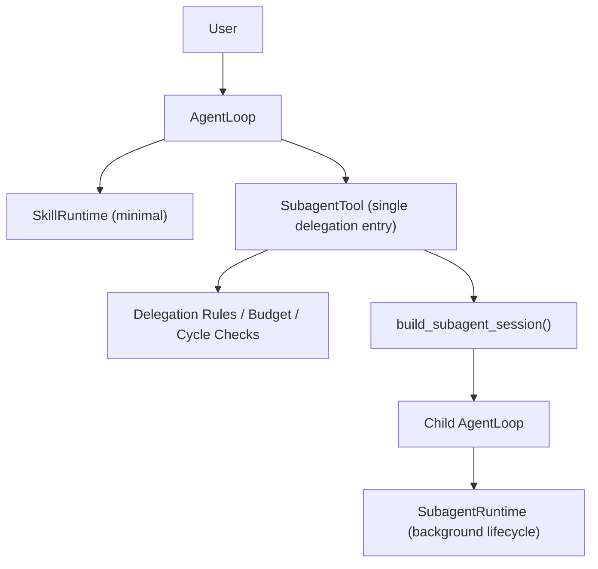

# Rusty-Claw Skill Runtime Simplification Design

> 状态: Implemented
>  
> 最后更新: 2026-04-06

---

## 1. 背景

当前仓库里，`skill` 与 `subagent` 的能力边界较为重叠，但实现路径分散：

- 顶层 skill 依赖 `SkillRuntime` 作为 `ExecutionExtension`
- skill 间委派依赖独立的 `CallSkillTool`
- 普通委派依赖统一的 `subagent` 工具
- 后台任务由 `SubagentRuntime` 管理

这导致系统同时维护两套“委派执行”逻辑：

1. `call_skill`
   - 有 skill 注册表查找
   - 有环路检测、深度限制、总预算限制
   - 有工具可见性交集与缺失工具预检
   - 没有后台 job 语义
2. `subagent`
   - 有同步 / 后台 / 轮询 / 取消 / 通知
   - 没有 skill 专属校验链
   - 仍然需要额外依赖 `call_skill` 才能执行 skill 委派

同时，当前 skill 运行时还承担了过多职责：

- 长期 active skill mode
- 交互式用户恢复
- artifact contract 校验
- output mode 约束
- skill 委派编排
- 子会话工具策略

这些职责混在一起，使得 `SkillRuntime`、`CallSkillTool` 和 `SubagentTool` 都“过度理解 skill”。

本设计的目标是：**收敛 skill 语义，统一委派入口，保留顶层交互能力，但尽量删除 skill 专属运行时逻辑。**

---

## 2. 设计目标

### 2.1 必须达成

1. `subagent` 成为唯一的委派入口
2. skill 只保留“声明式模板”职责，而不是第二套执行系统
3. 顶层 skill 仍然支持跨用户回复恢复
4. 委派出的子会话一律非交互，不等待用户输入
5. skill 参数能力保留，但不引入模板引擎
6. 保持现有 cycle / depth / delegation budget 安全约束
7. 允许非交互 skill 在受控条件下继续嵌套委派
8. 迁移过程分阶段进行，先兼容、后删除旧接口

### 2.2 明确不做

1. 不支持 subagent 等待用户输入
2. 不支持无界 `subagent -> subagent` 递归
3. 不支持 `{{topic}}` 之类的模板替换语义
4. 不在第一阶段删除所有旧 frontmatter 字段；但会停止依赖其运行时语义
5. 不为 skill 保留长期会话级 ambient mode

---

## 3. 核心设计原则

### 3.1 Skill 是 Invocation，不是 Session Mode

本设计不再把 skill 视为“启动后长期接管父 session 的模式”，而是视为一个**invocation-scoped workflow**：

- skill 调用开始时创建 invocation 状态
- invocation 完成后立即清理
- 只有在“等待用户回答”期间，这个 invocation 才跨轮存在
- 完成后后续普通请求不再继续继承 skill prompt / tool policy

换句话说：

- 不是 `session-scoped mode`
- 而是 `invocation-scoped workflow`

### 3.2 Subagent 负责“怎么跑”

`subagent` 负责：

- 创建子会话
- 承载同步 / 后台执行
- 承载 status / cancel / list / notification
- 承载嵌套 delegation 预算继承
- 承载 skill 委派的安全校验链

### 3.3 Skill 负责“跑什么”

skill 只负责：

- 指令正文
- 工具白名单
- 参数定义
- 可选的交互性声明

skill 不再负责：

- 独立的委派工具实现
- artifact completion contract
- output mode gating
- 自己的一套后台 / 轮询 / 状态系统

### 3.4 顶层可交互，子会话不可交互

这是本设计的硬边界：

- 顶层 skill invocation 可以使用 `ask_user_question`
- 任何通过 `subagent` 委派出的 skill / task 都必须是非交互的
- 如果一个 skill 是交互型，则只能在父 session 顶层运行

这条边界可以显著降低状态同步、恢复路径和用户体验上的复杂度。

---

## 4. 目标架构

### 4.1 模块职责



### 4.2 模块边界

#### `SkillRuntime`

保留最小职责：

- 识别 `/skill_name ...`
- 维护当前 `SkillInvocation`
- prompt 注入
- 顶层 tool filtering
- `ask_user_question` 恢复
- invocation 结束后清理

#### `SubagentTool`

扩展为统一委派入口：

- 普通任务委派
- skill 委派
- 同步执行
- 后台执行
- 统一结果结构

#### `Delegation` 共享层

抽出共享的委派策略：

- registry lookup
- cycle detection
- depth limit
- total delegation budget
- effective tools
- budget shrink
- structured failure

建议新增文件：

- `src/delegation.rs`

第一阶段从现有实现中提取并收敛以下逻辑：

- `SkillCallContext` -> 未来的 `DelegationContext`
- lineage append / shared total budget
- cycle / depth / budget 检查
- effective tool 交集计算
- effective step / timeout 收缩
- `SkillCallFailure` -> 未来的 `DelegationFailure`

这些逻辑当前主要分散在：

- `src/tools/skills.rs`
- `src/skills/call_tree.rs`

#### `build_subagent_session()`

继续作为唯一子会话构造入口，负责：

- 组装子 session prompt
- 注入可见工具
- 注入最小 skill runtime
- 绑定 transcript / event log / telemetry / task state

---

## 5. 简化后的 Skill 模型

### 5.1 SkillDef

目标上希望 skill 逐步收敛到：

```rust
pub struct SkillDef {
    pub meta: SkillMeta,
    pub instructions: String,
    pub parameters: Option<serde_json::Value>,
}

pub struct SkillMeta {
    pub name: String,
    pub version: String,
    pub description: String,
    pub allowed_tools: Vec<String>,
}
```

### 5.2 旧字段迁移策略

第一阶段 parser 继续接受旧字段。目标状态下，runtime 最终将不再依赖：

- `trigger`
- `output_mode`
- `constraints.forbid_code_write`
- `constraints.required_artifact_kind`

但在迁移期（Phase 0-5），若基线测试表明仍有行为依赖，则保留兼容路径，直到 `subagent(skill)` 与兼容层完全稳定后再统一删除。

原因：

- `forbid_code_write` 与 `allowed_tools` 高度重叠
- `output_mode` / artifact contract 增加了较重的运行时状态机
- 这些字段在现阶段并不值得继续扩大耦合面

### 5.3 交互性声明

第一阶段有两种实现方式：

1. 显式 metadata 字段，例如 `interactive: true`
2. 从 `allowed_tools` 是否包含 `ask_user_question` 推导

为了降低迁移成本，建议第一阶段采用**保守推导策略**：

- 如果 skill 可见工具包含 `ask_user_question`
- 则视为 interactive skill
- interactive skill 只能顶层运行，不能通过 `subagent(skill)` 委派

对于 `allowed_tools` 为空的 skill，需要额外明确：

- 顶层运行时：`allowed_tools` 为空仍按“允许所有工具”处理，保持现有宽松语义
- 委派判定时：`allowed_tools` 为空视为 **默认不可委派**
- 只有显式声明工具白名单、且不包含 `ask_user_question` 的 skill，才视为可通过 `subagent(skill)` 委派

这样做的原因是：

- `allowed_tools` 为空本身语义过宽
- 若直接推导为“可委派”，会把交互能力和工具能力一起下放给子会话
- 对委派能力采取显式白名单，能减少误判与隐式行为

后续如果需要更精细语义，再补显式字段。

---

## 6. 参数模型

### 6.1 设计目标

保留 `parameters`，但将其职责收敛为：

1. 参数校验
2. CLI / help 展示
3. prompt 中的结构化参数注入

### 6.2 明确不做

以下能力不再作为运行时语义支持：

- `{{topic}}` 文本替换
- `{{language}}` 模板展开
- 通过正文模板拼接命令
- 让 runtime 推断 raw string 应如何替换到 markdown 正文中

### 6.3 参数传递方式

#### 顶层 `/skill_name ...`

支持两种输入：

1. raw args
   - `/review_code src/parser.rs`
2. structured json
   - `/review_code {"path":"src/parser.rs","focus":"error handling"}`

#### `subagent(skill)`

统一使用结构化参数：

```json
{
  "action": "run",
  "skill_name": "summarize_info",
  "skill_args": {
    "input": "/tmp/article.txt",
    "language": "zh"
  },
  "background": false
}
```

### 6.4 Prompt 注入方式

参数不做模板替换，而是固定注入：

```text
## Skill Arguments (JSON)
{"input":"/tmp/article.txt","language":"zh"}
```

如果顶层调用使用 raw args，则同时注入：

```text
## Skill Arguments (Raw)
src/parser.rs
```

这样 skill 仍然能“看见参数”，但 runtime 不需要模板引擎。

---

## 7. 新的运行时模型

### 7.1 顶层 Skill Invocation

顶层 `/skill_name ...` 的执行语义：

1. CLI 透传未知 slash command 给 `AgentLoop`
2. `SkillRuntime` 查 skill 注册表
3. 创建一个 `SkillInvocation`
4. 对当前 invocation 注入：
   - skill instructions
   - structured args
   - allowed tools
5. 如果 skill 使用 `ask_user_question`
   - 父 session 进入等待用户状态
   - 用户回复后恢复当前 invocation
6. invocation 完成后立即清理

### 7.2 子会话 Skill 委派

`subagent(action="run", skill_name=...)` 的执行语义：

1. `SubagentTool` 查 skill 注册表
2. 判断该 skill 是否 interactive
   - 若 interactive，则拒绝委派
3. 执行 skill delegation 校验链
4. 根据 skill 计算 effective tools / effective budget
5. 使用 `build_subagent_session()` 创建子 session
6. 子 session 以 `/{skill_name}` 作为启动命令运行
7. 返回统一的 `SubagentResult`

其中 `context` 的语义需要固定下来：

- 在 `skill_name` 模式下，`context` 是**附加指令**
- 它会作为额外执行上下文追加到 skill instructions 之后
- 它不会替代 skill 本身的 instructions

这与当前 `call_skill.input_summary` 的语义保持一致。

### 7.3 为什么仍然保留顶层 `SkillRuntime`

因为 `subagent` 被明确约束为非交互，所以顶层交互型 skill 仍然需要一个很薄的 runtime：

- 保存当前 invocation
- 恢复 pending user interaction
- 在当前父 session 中继续执行

因此，目标不是“彻底删除 SkillRuntime”，而是“把 SkillRuntime 缩到只剩顶层交互必需能力”。

---

## 8. 统一后的 Delegation 模型

### 8.1 DelegationContext

当前代码中的 `SkillCallContext` 本质上已经是 delegation context。

第一阶段可以沿用现有结构，后续再命名收敛：

```rust
pub struct DelegationContext {
    pub lineage: Vec<DelegationFrame>,
    pub total_delegations: Arc<AtomicUsize>,
    pub root_session_id: String,
}
```

### 8.2 约束规则

统一保留以下约束：

1. 最大委派深度：`3`
2. 单次根请求最大总委派数：`6`
3. timeout 只能继承并收缩
4. step budget 只能继承并收缩
5. tool capability 只能取交集，不能放大

### 8.3 防环策略

仅对 **skill delegation** 进行语义级防环：

- `A -> B -> A` 拒绝
- `A -> A` 拒绝

普通 raw `goal` subagent 不做“目标文本语义防环”，只走深度和预算限制。

### 8.4 budget shrink 策略

沿用当前收缩思路：

- `effective_child_steps = min(requested, max(1, parent_remaining_steps / 2))`
- `effective_child_timeout = min(requested, parent_remaining_timeout)`

### 8.5 nested delegation 允许范围

第一阶段的开放规则：

- 顶层主 agent 可以调用 `subagent`
- interactive top-level skill 可以调用 `subagent`
- delegated non-interactive skill 子会话若 effective tools 含 `subagent`，可继续委派
- 普通 raw subagent 默认不开放 raw `subagent -> subagent`

这对应的语义是：

- 支持 **skill-scoped nested delegation**
- 不支持无限 raw worker tree

---

## 9. Subagent 统一接口设计

### 9.1 `action="run"` 扩展

目标接口：

```json
{
  "action": "run",
  "goal": "inspect parser flow",
  "context": "we are debugging recent parser changes",
  "background": false,
  "skill_name": null,
  "skill_args": null,
  "timeout_sec": 60,
  "max_steps": 5
}
```

skill 模式示例：

```json
{
  "action": "run",
  "skill_name": "summarize_info",
  "skill_args": {
    "input": "/tmp/article.txt",
    "language": "zh"
  },
  "context": "Summarize this article into 3 concise bullets.",
  "background": true,
  "timeout_sec": 120,
  "max_steps": 8
}
```

### 9.2 参数约束

- `goal` 与 `skill_name` 二选一
- `skill_args` 只能与 `skill_name` 同时出现
- interactive skill 不允许 `background=true`
- interactive skill 不允许任何 subagent 调用
- 当 `skill_name` 存在时，`context` 仅作为附加指令，不替代 skill instructions

### 9.3 统一结果结构

扩展现有 `SubagentResult`：

```rust
pub struct SubagentResult {
    pub ok: bool,
    pub summary: String,
    pub findings: Vec<String>,
    pub artifacts: Vec<String>,
    pub sub_session_id: Option<String>,
    pub transcript_path: Option<String>,
    pub event_log_path: Option<String>,
    pub skill_name: Option<String>,
    pub lineage: Option<Vec<String>>,
    pub effective_tools: Option<Vec<String>>,
    pub effective_max_steps: Option<usize>,
    pub effective_timeout_sec: Option<u64>,
    pub failure: Option<DelegationFailure>,
}
```

其中：

- 若 `skill_name.is_some()`，则表示本次 delegation 是 skill 模式
- 若 `skill_name.is_none()`，则表示本次 delegation 是普通 task 模式

不额外引入 `mode` 字段，以减少结果结构冗余。

这样同步、后台、status、notification 都统一读这一套。

---

## 10. 最小化后的 SkillRuntime

### 10.1 目标状态结构

建议将当前 `ActiveSkillState` 收缩为：

```rust
pub struct SkillInvocation {
    pub skill_name: String,
    pub instructions: String,
    pub allowed_tools: Vec<String>,
    pub raw_args: Option<String>,
    pub json_args: Option<serde_json::Value>,
    pub pending_interaction: Option<PendingInteraction>,
}
```

### 10.2 删除的状态负担

以下能力从 `SkillRuntime` 中移除：

- artifact 列表与 contract 校验
- `WaitingSubagent`
- `ValidatingArtifacts`
- labels / phase map
- output_mode gating
- skill 内部 delegation 执行器

### 10.3 保留的状态

仅保留：

- `Running`
- `WaitingUser`

这使得顶层交互 skill 仍可恢复，但 skill 运行时不再承担“流程引擎”的角色。

---

## 11. 兼容性与迁移策略

### 11.1 `CallSkillTool` 迁移策略

已完成的迁移路径：

1. 先把 skill 委派能力下沉到 `SubagentTool`
2. 更新现有 `SKILL.md` 和 prompt
3. 测试稳定后删除 `CallSkillTool` 注册与主体实现

### 11.2 旧别名兼容

第一阶段继续接受这些旧名字，但都 canonicalize 到 `subagent`：

- `spawn_subagent`
- `get_subagent_result`
- `cancel_subagent`
- `list_subagent_jobs`

### 11.3 旧 frontmatter 字段兼容

第一阶段 parser 继续接受旧字段，但：

- runtime 不再深度依赖
- 在日志中标记 deprecated
- 设计文档和 skill 样例逐步迁移到新语义

---

## 12. 实施步骤

### Phase 0: 冻结现状并补基线测试

目标：

- 为当前行为建立回归保护，避免重构后无对照
- 这是阻塞阶段；未完成前，不进入后续编码阶段

任务：

- [x] 为 delegation / subagent / top-level interactive skill 增加回归测试
- [x] 覆盖 cycle detection / depth limit / total delegation budget / missing tools
- [x] 覆盖 `ask_user_question -> 用户回复 -> resume`
- [x] 覆盖普通 `subagent` 的同步 / 后台 / status / cancel 基线
- [x] 明确 legacy 字段仅保留解析与 warning，不再作为最终运行时语义

涉及文件：

- `src/tools/subagent.rs`
- `src/skills/runtime.rs`
- `src/subagent_runtime.rs`
- `src/delegation.rs`

### Phase 1: 收缩 SkillRuntime

目标：

- 将 `SkillRuntime` 收缩成“顶层 invocation 管理器”
- 这一阶段以结构收缩为主，不主动删除仍被基线依赖的 legacy 行为

任务：

- [x] 将 `src/skills/state.rs` 收缩为 `SkillInvocation`
- [x] 删除 labels / phase / artifact contract / waiting-subagent 等运行时状态
- [x] 保留 slash 激活、prompt 注入、tool filtering、resume、finish cleanup
- [x] 将 legacy 字段围到兼容 warning 中，不再阻塞 finish 或额外劫持工具
- [x] 保持 invocation 完成后的清理路径正确

完成标志：

- [x] 顶层 interactive skill 仍可正常运行
- [x] invocation 完成后不再污染后续普通请求

### Phase 2: 参数模型收敛

目标：

- 保留 `parameters`，删除模板语义

任务：

- [x] 保留 `src/skills/parser.rs` 的 `parameters` 解析
- [x] 新增共享参数校验 helper，供顶层 skill invocation 与 `subagent(skill)` 共用
- [x] 将 raw/json 参数以固定段落注入 prompt
- [x] 更新技能文档约定，由模板占位改为读取结构化参数段

完成标志：

- [x] JSON skill args 可校验
- [x] 运行时不再依赖 `{{var}}`

### Phase 3: 统一 delegation 逻辑到 subagent

目标：

- `subagent` 成为唯一委派入口
- 统一 cycle / depth / budget / tool intersection / limit shrink 逻辑

任务：

- [x] 新增共享模块 `src/delegation.rs`
- [x] 提取 lineage / cycle / depth / total budget / tool intersection / limit shrink 逻辑
- [x] 扩展 `src/tools/subagent.rs` 的 `Run` 参数：`skill_name`, `skill_args`, `timeout_sec`, `max_steps`
- [x] 让 skill 模式走统一 delegation 校验链，普通模式保持现有行为
- [x] 扩展 `SubagentResult`，支持 skill 模式结构化结果
- [x] interactive skill 若被 `subagent(skill)` 调用则直接拒绝
- [x] 验证 delegation context 与 `DelegationSessionSeed` 在嵌套 skill delegation 中正确继承

完成标志：

- [x] 同一个 `subagent` 工具可同时承担 task delegation 与 skill delegation

### Phase 4: 支持 background skill delegation

目标：

- 让 `subagent(skill, background=true)` 成为一等能力

任务：

- [x] 修改 `src/subagent_runtime.rs`，让 job request 承载 skill 模式信息
- [x] 让后台 job 返回统一结果结构
- [x] 修改 `src/session/factory.rs`，使 `build_subagent_session()` 支持 skill 模式
- [x] 根据 effective tools 决定子会话是否暴露 `subagent`
- [x] 保持 `SubagentNotificationExtension` 的 next-turn notice 机制

完成标志：

- [x] background skill delegation 可轮询、可消费、可通知

### Phase 5: 将 CallSkillTool 退化为兼容层

目标：

- 降低迁移风险，最终由 `subagent` 完成收口

任务：

- [x] 将 `call_skill` 的心智与说明合并到 `subagent(skill_name=...)`
- [x] 明确 `context` 在 skill 模式下是附加指令
- [x] 通过 alias canonicalization 保留旧名字兼容
- [x] 在最终收口前完成所有技能文档迁移与测试迁移

完成标志：

- [x] 新逻辑已完全落到 `subagent`
- [x] 旧别名仍可 canonicalize 到 `subagent`

### Phase 6: 迁移 skill 文档并删除旧实现

目标：

- 完成文档迁移并移除旧入口

任务：

- [x] 更新 `skills/**/SKILL.md`，不再写 `call_skill`
- [x] 更新 `skills/**/SKILL.md`，不再写 `spawn_subagent/get_subagent_result` 旧心智
- [x] 更新 `skills/**/SKILL.md`，不再依赖模板占位符
- [x] 修改 `src/session/factory.rs`，移除 `CallSkillTool` 注册
- [x] 删除 `src/tools/skills.rs` 主体实现
- [x] 清理 parser/runtime 中对 legacy field 的运行时依赖
- [x] 删除 `output_mode` / `required_artifact_kind` / `forbid_code_write` 的独立运行时语义

完成标志：

- [x] `subagent` 成为唯一委派入口
- [x] skill 运行时仅保留最小顶层交互支持

---

## 13. 测试计划

必须覆盖以下场景：

1. 顶层 `/skill_name raw args` 成功激活
2. 顶层 `/skill_name {"json":"args"}` 参数校验成功
3. 参数校验失败返回明确错误
4. interactive skill 在顶层能够 `ask_user_question` 并恢复
5. `subagent(skill)` 成功执行 non-interactive skill
6. `subagent(skill, background=true)` 可通过 `status` 拿到统一结果
7. `subagent(skill)` 拒绝 interactive skill
8. cycle detection 仍生效
9. 最大深度限制仍生效
10. 总 delegation budget 仍生效
11. missing tools 预检仍生效
12. 普通 `subagent(goal=...)` 行为不回归
13. skill-owned child session 在允许时可继续 `subagent`
14. raw subagent 默认仍禁止 raw `subagent -> subagent`
15. background job notification / status / consume 不回归

---

## 14. 风险与控制

### 风险 1: 顶层 interactive skill 恢复行为回归

控制方式：

- Phase 1 前先补恢复测试
- 保持 `SkillRuntime` 只缩职责，不在第一阶段直接删除

### 风险 2: 旧 skill 文档大量依赖旧接口心智

控制方式：

- 保留 `CallSkillTool` 兼容层
- 先迁移 runtime，再迁移 skill 文档

### 风险 3: subagent 承担过多逻辑后实现复杂度上升

控制方式：

- 抽出共享 `delegation` 模块
- 不把顶层 interactive 恢复也塞进 `subagent`
- 保持“顶层 invocation / 子会话 delegation”边界清晰

### 风险 4: 过早开放无限嵌套委派

控制方式：

- 第一阶段只开放 skill-scoped nested delegation
- raw worker tree 继续默认叶子化

### 风险 5: Phase 3 统一 delegation 时出现行为回退

控制方式：

- 在进入 Phase 3 前保留完整 `CallSkillTool` 实现
- Phase 3-4 期间将 `CallSkillTool` 作为完整对照和回滚路径
- 只有在 Phase 5 之后，才将其降级为兼容层
- 在开始 Phase 3 前创建独立分支 / tag，便于快速回退

---

## 15. 最终预期状态

重构完成后，系统的最终边界应当是：

- skill 不是普通聊天指令，但也不是长期会话模式
- skill 是“可恢复的顶层 invocation”
- 顶层 invocation 可以交互
- subagent invocation 不可交互
- 所有委派统一走 `subagent`
- skill 层只保留最少的声明式信息

系统心智将从当前的：

- `SkillRuntime + CallSkillTool + SubagentTool`

收敛为：

- `Minimal SkillRuntime + Unified Subagent Delegation`

这会显著降低 skill 专属逻辑在代码库中的扩散程度，同时保留顶层交互型 workflow 所必需的能力。
