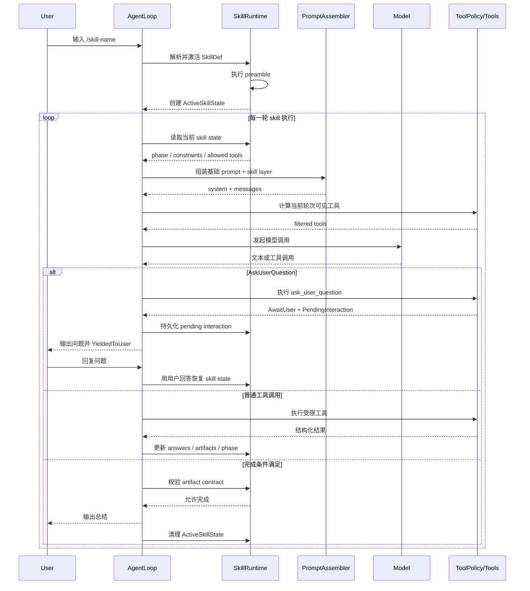
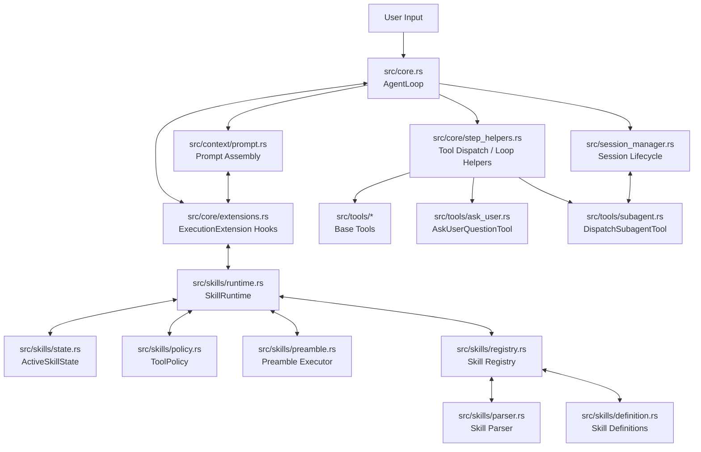
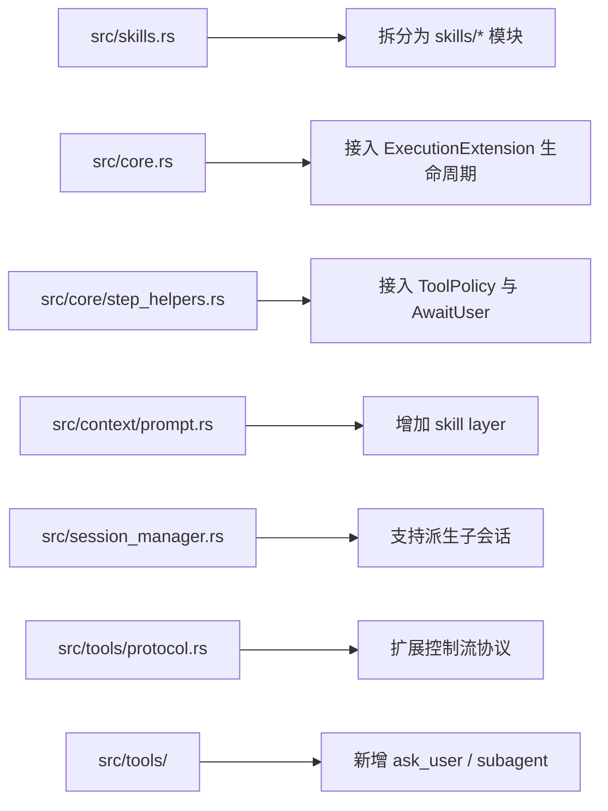

# Rusty-Claw 复杂技能运行时设计 (v2 — 评审修订版)

## 1. 背景

<!-- REVIEW (Strict): 背景分析准确。引入 General Skill Runtime 是必要的。重点在于如何确保这套运行时不仅能跑通 office-hours，还能通过通用的钩子机制（ExecutionExtension）适配未来不可预见的 SOP 类型。 -->

当前 `rusty-claw` 的 skill 机制本质上是"把 Markdown 解析成动态 Tool，再把正文当作脚本模板执行"。

这套模型适合：

- 小型自动化脚本
- 单次参数化命令
- 简单的 bash / python 封装

但它无法稳定承载类似 `gstack/office-hours/SKILL.md` 这样的复杂 skill。这里要强调的是：`office-hours` 只是一个高强度样例，用来暴露复杂 skill 的需求上限，而不是本设计唯一要服务的目标模型。

我们真正要支持的是 **general SKILL runtime**。这类 skill 的共同点不是"长得像 office-hours"，而是：

- 有结构化 frontmatter 和能力白名单
- 有必须先执行的 preamble
- 有多阶段工作流和显式阶段切换
- 有强约束的人机交互协议
- 有阶段内状态和恢复需求
- 可能派生子智能体或跨模型 second opinion
- 对输出产物有硬约束，例如"只能产出设计文档，不能写代码"

因此，本项目需要的不是"更强的 SkillTool"，而是一个新的 **General Skill Runtime**。

## 2. 设计目标

### 2.1 必须达成

<!-- REVIEW (Strict): 目标 7 的“持久化与恢复”需明确是否包含 Workspace 状态。如果 Skill 执行中途 crash，恢复时如何确保文件系统状态与 ActiveSkillState 一致？建议增加“Workspace 状态一致性校验”作为进阶目标。 -->

1. 支持统一的 SKILL 定义模型，而不是长期维持双轨系统
2. 支持递归发现 `skills/**/SKILL.md`
3. 支持 skill 级 prompt 注入，但不破坏现有 system / project / memory / task-plan 约束
4. 支持 skill 级工具 white-list 与能力策略
5. 支持技能内提问、暂停、恢复
6. 支持受限子会话执行
7. 支持技能状态持久化与恢复
8. 支持技能级 hard gate 与 artifact contract
9. 让 skill 运行时足够通用，不把 `office-hours` 的阶段结构硬编码成全局模型

### 2.2 明确不做

1. 不长期保留"legacy skill / workflow skill"双轨架构
2. 不让 skill runtime 直接替代 `AgentLoop`
3. 不在第一阶段支持任意 DSL 或自定义解释器
4. 不依赖异常式控制流把"等待用户"编码成错误

## 3. 从 gstack office-hours 提炼出的真实需求

参考：

- GitHub 页面：<https://github.com/garrytan/gstack/blob/main/office-hours/SKILL.md>
- Raw 文件：<https://raw.githubusercontent.com/garrytan/gstack/refs/heads/main/office-hours/SKILL.md>

从 `office-hours` 可以抽出以下能力需求：

1. Skill frontmatter 不只是 name / description，还包含 `version`、`allowed-tools`、`preamble-tier`、触发语义。
2. Skill 正文不是"脚本正文"，而是一份高优先级操作手册。
3. Skill 在正文执行前需要运行 preamble，并把输出变量注入后续执行。
4. Skill 需要结构化提问能力 `AskUserQuestion`，包括推荐项、选项和暂停恢复。
5. Skill 需要阶段化工作流，例如 context gathering、mode selection、questioning、cross-model opinion、artifact write。
6. Skill 的目标不是"完成任意用户请求"，而是"在严格约束下完成一类工作流"。
7. Skill 可能带有 hard gate，例如 "Do NOT write code"。

因此，复杂 skill 必须建模为"有状态的执行会话"，而不是普通 Tool。  
同时，运行时抽象应当覆盖比 `office-hours` 更广的 skill 形态：

- 研究型 skill
- 审查型 skill
- 文档产出型 skill
- 引导式问答型 skill
- 带子任务编排的 skill

## 4. 总体方案

### 4.1 技能模型

引入统一的技能定义：

```rust
pub struct SkillDef {
    pub meta: SkillMeta,
    pub instructions: String,
    pub preamble: Option<SkillPreamble>,
    pub constraints: SkillConstraints,  // 合并原 SkillPolicies + SkillConstraints
}
```

设计原则：

- 所有 skill 最终都收敛到同一模型
- 当前 `skills/*.md` 可以通过一次性迁移脚本转为新格式
- 不为旧格式长期保留并行运行时

### 4.2 运行时分层

系统执行时有三层：

1. `AgentLoop`
   - 仍然是主循环
2. `ExecutionExtension`
   - 以中间件 / 生命周期钩子形式挂载到 `AgentLoop`
3. `SkillRuntime`
   - 作为一种 `ExecutionExtension`，接管复杂 skill 的生命周期
4. `ToolPolicy`
   - 决定当前轮次真正暴露给模型的工具集合

复杂 skill 不会替换 `AgentLoop`，而是以扩展的方式接入执行流程；`ActiveSkillState` 由 `SkillRuntime` 独占所有权。

### 4.3 通用性原则

为了避免过度贴合 `office-hours`，运行时只内建最小公共抽象，不内建具体业务阶段。

运行时只假定 skill 需要以下通用能力：

1. 启动前准备
2. 执行中状态
3. 工具能力约束
4. 用户交互挂起与恢复
5. 可选子任务派发
6. artifact 与完成条件校验

像 `Phase 1/2A/2B/3.5` 这样的具体阶段命名，属于 skill 自己的 instructions / state，不属于 runtime 的全局固定协议。

### 4.4 AgentLoop 与 Skill Runtime 的关系

两者的关系不是"二选一"，也不是"复杂 skill 取代 AgentLoop"。

正确关系是：

- `AgentLoop` 是宿主执行循环
- `SkillRuntime` 不是直接侵入 `AgentLoop` 主循环逻辑，而是作为扩展挂载到若干生命周期钩子上
- `SkillDef` 激活后，会通过扩展接口影响 prompt 组装、工具暴露、交互恢复和完成条件
- `SkillDef` 结束后，对这些钩子的影响自动消失，`AgentLoop` 恢复默认模式

因此，复杂 skill 的执行始终由 `AgentLoop` 驱动，但 `AgentLoop` 不应直接依赖 `ActiveSkillState` 的内部结构。

推荐方式是为主循环暴露少量稳定的扩展点，例如：

- `before_turn_start`
- `before_prompt_build`
- `before_tool_resolution`
- `after_tool_result`
- `before_finish`
- `on_user_resume`

`SkillRuntime` 通过这些扩展点介入，而不是让 `src/core.rs` 直接理解 skill 生命周期细节。

**扩展钩子的异步边界**：鉴于 `AgentLoop` 的 `step()` 方法本身是 `async fn`，所有扩展钩子统一使用 `#[async_trait]` 签名，以支持 preamble 执行、子会话派发等异步操作，避免在异步运行时内部 `block_on` 导致死锁。

**多扩展并存时的合并规则**：`AgentLoop` 通过 `Vec<Box<dyn ExecutionExtension>>` 管理扩展，钩子执行顺序采用责任链模型（chain of responsibility），依次折叠各扩展的输出：

```rust
// 依次调用，每个扩展在前一个基础上做增量变换
let tools = extensions.iter().fold(base_tools, |tools, ext| {
    ext.before_tool_resolution(tools).await
});
```

### 4.5 时序图

下面是复杂 skill 的标准执行时序：



这个时序图表达了三个关键点：

1. `AgentLoop` 始终是总控者
2. `SkillRuntime` 负责"当前 skill 怎么运行"
3. prompt、工具、交互恢复都受当前 `ActiveSkillState` 影响

### 4.6 模块级改造图

下面的模块图说明这套设计如何落到当前代码结构上：



这张图里的原则是：

- `src/core.rs` 不直接理解每一种 skill 细节
- `SkillRuntime` 负责复杂 skill 的状态与约束
- `Prompt Assembly` 和 `Tool Dispatch` 只通过扩展接口工作
- `SessionManager` 只在子会话派生时与 skill 系统耦合

## 4.7 现有模块到新职责的映射

### `src/core.rs`

保留职责：

- 主循环 (`step()` 方法)
- 模型调用 (通过 `llm.stream()`)
- run exit 管理 (`RunExit` 枚举)
- 全局取消、完成、yield 处理
- energy 管理与 autopilot 审计

新增职责：

- 持有 `Vec<Box<dyn ExecutionExtension>>` 扩展列表
- 在固定生命周期节点调用扩展钩子
- 保持主循环对 skill 内部状态细节无感

不应承担：

- 解析 `SKILL.md`
- 直接维护复杂 skill phase 逻辑
- 直接维护 allowed tools 细节
- 直接读写 `ActiveSkillState`

> **具体改动点**：当前 `AgentLoop` 在构造时接收 `tools: Vec<Arc<dyn Tool>>`。改造后需新增 `extensions: Vec<Box<dyn ExecutionExtension>>` 字段。在 `step()` 主循环中，在 `load_current_tools()` 前调用 `before_tool_resolution()` 钩子；在 `collect_iteration_response()` 前调用 `before_prompt_build()` 钩子。

### `src/core/extensions.rs`

建议新增一个轻量级扩展接口层，作为 `AgentLoop` 和 `SkillRuntime` 之间的边界：

```rust
#[async_trait]
pub trait ExecutionExtension: Send + Sync {
    async fn before_turn_start(&self, input: &str) -> ExtensionDecision;
    async fn before_prompt_build(&self, draft: PromptDraft) -> PromptDraft;
    async fn before_tool_resolution(&self, tools: Vec<Arc<dyn Tool>>) -> Vec<Arc<dyn Tool>>;
    async fn after_tool_result(&self, result: &ToolExecutionEnvelope);
    async fn on_user_resume(&self, input: &str) -> ResumeDecision;
    async fn before_finish(&self) -> FinishDecision;
}

pub enum ExtensionDecision {
    Continue,
    Intercept { prompt_overlay: Option<String> },
}

pub enum ResumeDecision {
    ResumeSkill { context_key: String, answer: String },
    PassThrough,
}

pub enum FinishDecision {
    Allow,
    Deny { reason: String },
}

pub struct PromptDraft {
    pub skill_contract: Option<String>,
    pub skill_instructions: Option<String>,
    pub skill_state_summary: Option<String>,
}
```

这层接口的价值在于：

- 保护 `AgentLoop` 的单一职责
- 允许未来不仅有 `SkillRuntime`，还可挂载别的执行扩展
- 让 skill 系统以依赖倒置方式接入现有主循环
- 所有钩子为 `async` 方法，与 `AgentLoop` 的异步执行模型一致

### `src/core/step_helpers.rs`

保留职责：

- 当前轮次 tool dispatch (`dispatch_tool_call`)
- tool result 处理 (`handle_successful_tool_effects`)
- iteration response 收集 (`collect_iteration_response`)

新增职责：

- 用扩展接口注入的 `ToolPolicy` 替代当前的 `load_current_tools()`
- 支持处理 `ask_user_question` 返回的 `AwaitUser`
- 在工具成功后把结构化结果广播给扩展层，而不是直接调用 `SkillRuntime`

> **具体改动点**：当前 `load_current_tools()` (step_helpers.rs:222-228) 直接调用 `crate::skills::load_skills("skills")` 追加所有 skill。改造后应先用 base tools，再通过 `extensions.before_tool_resolution()` 折叠过滤。`execute_tool_round()` 中新增对 `ToolExecutionEnvelope` 的 `await_user` 字段检查。

### `src/context/prompt.rs`

保留职责：

- 基础 prompt section 组装 (`build_prompt_sections`)
- history / memory / evidence 合并

新增职责：

- 接收扩展层返回的 `PromptDraft`
- 注入 `Skill Contract` (作为新的 prompt section)
- 注入 `Skill Instructions`
- 注入 `Skill State Summary`

> **具体改动点**：在 `build_llm_payload()` 中，在 Layer 2 (Evidence) 与 Layer 3 (Task State) 之间插入一个新的 Skill Layer。使用 `ContextAssembler` 的 candidate 模型加入 `SkillContract` 和 `SkillInstructions` 两个 candidate。

需要避免：

- 让 skill 正文直接覆盖现有 system/project/task-plan sections

### `src/context_assembler.rs`

保留职责：

- 5 层 prompt 组装与 token 预算管理

新增职责：

- 新增 `CandidateKind::SkillContract` 和 `CandidateKind::SkillInstructions` 类型
- 为 Skill Contract 分配 Layer 2.5（实际实现为 layer=2，priority 介于 Evidence 和 Task State 之间）

### `src/session_manager.rs`

保留职责：

- session 创建 (`get_or_create_session`)
- session 缓存
- 输出路由

新增职责：

- 为 `DispatchSubagentTool` 提供"受限派生会话"创建接口

需要避免：

- 让子会话直接复用普通长期 session 语义

### `src/skills.rs`

现状是动态工具加载器（`SkillTool`，272 行）。推荐迁移为统一 skill 系统入口：

- 短期：保留文件，转发到新的 `src/skills/mod.rs`
- 中期：让原有格式通过迁移工具或导入逻辑转为统一 `SkillDef`

> **具体改动点**：当前 `SkillTool` struct + `parse_skill_markdown()` + `load_skills()` 保持可用，但在 `src/skills/mod.rs` 中提供统一的 `load_all_skills()` 函数，内部先尝试新格式解析，fallback 到旧格式兼容解析。

### `src/tools/protocol.rs`

保留职责：

- `Tool` trait
- `ToolExecutionEnvelope`

新增职责：

- 支持"等待用户输入"的结构化控制信号

> **具体改动点**：在 `ToolExecutionEnvelope` 新增 `await_user: Option<UserPromptRequest>` 字段；在 `StructuredToolOutput` 新增对应的 builder 方法。

### `src/tools/*`

保留职责：

- 基础工具实现

新增工具：

- `ask_user.rs`
- `subagent.rs`

约束变化：

- 工具是否可见，不再只由"是否注册"决定，还要受 `ToolPolicy` 控制

## 4.8 推荐新增模块

```text
src/core/
  extensions.rs

src/skills/
  mod.rs
  parser.rs
  registry.rs
  definition.rs
  runtime.rs
  state.rs
  policy.rs
  preamble.rs
  migrate.rs
```

各文件职责建议如下：

- `mod.rs`
  - 对外导出统一 API，同时提供旧格式向下兼容入口
- `parser.rs`
  - 解析统一 `SKILL.md`（新格式 frontmatter + instructions）
- `registry.rs`
  - 递归发现技能并建立 registry
- `definition.rs`
  - 定义 `SkillDef`、frontmatter、约束模型（合并后的 `SkillConstraints`）
- `runtime.rs`
  - skill 生命周期、phase 迁移、恢复逻辑；实现 `ExecutionExtension` trait
- `state.rs`
  - `ActiveSkillState`、`PendingInteraction`、artifact 结构
- `policy.rs`
  - 工具白名单与能力映射
- `preamble.rs`
  - preamble 执行与结果解析
- `migrate.rs`
  - 将现有 6 个 skill 迁移到统一格式
- `src/core/extensions.rs`
  - 定义执行扩展接口与主循环钩子协议

## 4.9 推荐修改点总览



这份改造图的意图是把改动集中在几个清晰边界上：

- skill 建模集中在 `src/skills/*`
- 宿主循环改动集中在 `src/core.rs`
- 每轮工具策略改动集中在 `src/core/step_helpers.rs`
- prompt 分层改动集中在 `src/context/prompt.rs`
- 子会话派生改动集中在 `src/session_manager.rs`

## 5. 技能定义模型

统一 skill 定义如下：

```rust
pub struct SkillDef {
    pub meta: SkillMeta,
    pub instructions: String,
    pub preamble: Option<SkillPreamble>,
    pub constraints: SkillConstraints,
}

pub struct SkillMeta {
    pub name: String,
    pub version: String,
    pub description: String,
    pub trigger: SkillTrigger,
    pub allowed_tools: Vec<String>,
    pub output_mode: Option<OutputMode>,
}
```

### 5.1 关键附属结构

```rust
pub enum SkillTrigger {
    ManualOnly,
    SuggestOnly,
    ManualOrSuggested,
}

pub enum OutputMode {
    Freeform,
    DesignDocOnly,
    ReviewOnly,
}

/// 合并原 SkillPolicies + SkillConstraints，消除 DRY 违反
pub struct SkillConstraints {
    pub forbid_code_write: bool,
    pub allow_subagents: bool,
    pub require_question_resume: bool,
    pub required_artifact_kind: Option<ArtifactKind>,
}

pub enum ArtifactKind {
    DesignDoc,
    ReviewReport,
}

pub struct SkillPreamble {
    pub shell: String,
    pub tier: Option<u8>,
}
```

### 5.2 通用性边界

统一模型只描述"运行时需要知道的东西"，不把 skill 的业务 SOP 硬编码进 schema。

也就是说：

- `allowed_tools`、`preamble`、`constraints` 属于 runtime 元数据
- `Phase 2.5`、`builder mode`、`startup critique` 这类内容属于 skill 自身 instructions

这样可以保证 runtime 通用，而不是为某一个 skill 的工作流量身定做。

## 6. Skill Runtime

### 6.1 ActiveSkillState

复杂 skill 激活后，在当前 session 上保存：

```rust
pub struct ActiveSkillState {
    pub skill_name: String,
    pub execution_state: SkillExecutionState,
    pub labels: std::collections::BTreeMap<String, String>,
    pub answers: std::collections::BTreeMap<String, SkillAnswer>,
    pub pending_interaction: Option<PendingInteraction>,
    pub preamble: Option<SkillPreambleState>,
    pub artifacts: Vec<SkillArtifact>,
    pub constraints: SkillConstraints,
}
```

**所有权模型**：`ActiveSkillState` 由 `SkillRuntime` 独占所有权，存储在 `SkillRuntime` 内部的 `Option<ActiveSkillState>` 字段中。`AgentLoop` 不持有对 `ActiveSkillState` 的任何引用（`&` 或 `&mut`），只能通过 `ExecutionExtension` trait 方法返回的值间接获取只读视图（如 `PromptDraft`、`ExtensionDecision` 等）。

### 6.2 通用执行状态

第一版推荐只内建少量通用执行状态：

1. `Bootstrapping`
2. `Running`
3. `WaitingUser`
4. `WaitingSubagent`
5. `ValidatingArtifacts`
6. `Completed`

skill 自己若需要更细的业务阶段，可通过 `labels` 或 `state summary` 维护，例如：

- `mode = startup`
- `phase = premise_confirmation`
- `review_round = second_opinion`

这样 runtime 只关心通用控制流，skill 细节仍由 skill 自己表达。

### 6.3 生命周期

1. 用户显式触发 `/skill-name`
2. 解析 `SkillDef`
3. 执行 preamble
4. 创建 `ActiveSkillState`
5. 注入 skill layer prompt
6. 使用 skill tool policy 驱动模型执行
7. 若触发交互，则持久化 `PendingInteraction` 并 `YieldedToUser`
8. 用户回复后恢复 skill
9. 满足 artifact contract 后退出 skill，恢复默认执行环境

## 7. Prompt Layering

### 7.1 现状问题

当前系统 prompt 中已经包含：

- 身份和基础系统规则
- runtime 环境
- `.claw_prompt.md`
- `AGENTS.md`
- `MEMORY.md`
- task plan 约束
- retrieved memory / evidence / rolling summary

复杂 skill 不能简单"覆盖"这些内容，否则会破坏现有系统不变量。

### 7.2 新的 prompt 优先级

建议按以下顺序组装（与 `ContextAssembler` 的 Layer 模型对齐）：

| Layer | 内容 | ContextAssembler 映射 |
|-------|------|---------------------|
| L0 | Core System Rules | `SystemInstruction` (required) |
| L0 | Runtime / Project Context | `SystemInstruction` (required) |
| L1 | Durable Memory | `DurableMemory` |
| L2 | Evidence | `Evidence` |
| **L2.5** | **Skill Contract + Instructions** | **新增 `SkillContract` candidate** |
| L3 | Task State | `TaskStateSummary` (required) |
| L4 | Volatile Transcript | `VolatileTurn` |

### 7.3 Skill Contract 内容

由 runtime 自动生成，而不是直接摘抄正文：

- 当前激活的 skill 名称和版本
- 当前阶段
- 允许使用的工具
- 本 skill 的 hard gate
- 当前待解决问题
- 当前已有的用户回答和产物
- 若存在 pending interaction，则说明必须先处理该问题

这样可以减少模型每轮反复重读大段 SOP 的不稳定性。

## 8. 工具白名单与能力控制

### 8.1 现状问题

当前每轮执行时 `load_current_tools()` (step_helpers.rs:222) 都会将基础工具与动态 skill 一起暴露给模型。复杂 skill 若只在某一处对 `tools` 做过滤，下一轮仍可能重新把所有 skill 加回来。

### 8.2 新方案

引入工具策略层：

```rust
pub trait ToolPolicy: Send + Sync {
    fn visible_tools(
        &self,
        base_tools: &[Arc<dyn Tool>],
        active_skill: Option<&SkillDef>,
    ) -> Vec<Arc<dyn Tool>>;

    fn can_call(&self, tool_name: &str) -> bool;
}
```

### 8.3 工具来源分类

1. Base tools（当前 `src/tools/*` 中注册的工具）
2. Skill runtime tools（`ask_user_question`、`dispatch_subagent`）
3. Imported skill actions（如未来有需要）

复杂 skill 的 `allowed_tools` 只对白名单内工具开放，并额外允许少数 runtime 必备工具：

- final visible text response 或其 skill completion 等价机制
- `ask_user_question`
- `dispatch_subagent`，仅当 skill constraints 允许

### 8.4 名称规范

必须统一工具名映射，避免依赖 UI 名称。映射表集中维护在 `src/skills/policy.rs` 中：

| UI 名称 | 内部名称 |
|---------|---------|
| `Bash` | `execute_bash` |
| `Read` | `read_file` |
| `Write` | `write_file` |
| `Edit` | `patch_file` |
| `AskUserQuestion` | `ask_user_question` |
| `WebSearch` | `web_search` |

## 9. Preamble 执行模型

### 9.1 设计原则

preamble 不是普通 bash tool 调用，而是 skill 启动阶段的受控步骤。

### 9.2 原因

像 `office-hours` 这类 skill 的 preamble 会：

- 初始化技能环境
- 设置状态变量
- 记录 analytics
- 输出控制变量
- 决定后续是否走 setup、upgrade、telemetry 等分支

这类逻辑需要：

- 在 skill 启动时执行一次
- 可收集 stdout / stderr
- 可解析关键变量
- 可在失败时降级或阻断

### 9.3 数据结构

```rust
pub struct SkillPreambleResult {
    pub ok: bool,
    pub stdout: String,
    pub stderr: String,
    pub vars: std::collections::BTreeMap<String, String>,
    pub side_effects: Vec<String>,
}
```

### 9.4 第一版约束

第一版只支持单段 shell preamble，并要求：

- 最长运行时间受限（默认 30 秒超时）
- 输出通过行协议解析变量（`KEY=VALUE` 格式）
- 失败时记录在 skill state 中
- 不允许在 preamble 阶段无限递归调用其他 skill

> **实现复用**：preamble 执行器与当前 `BashTool`（`src/tools/bash.rs`）共享底层 shell 执行逻辑。在 `src/skills/preamble.rs` 中调用 `tokio::process::Command`，而不是复制 `BashTool` 的实现。

## 10. 人机交互与恢复

### 10.1 现状

当前主循环已经支持"模型回复文本后直接让用户继续输入"（`RunExit::YieldedToUser`）。但复杂 skill 需要更强的交互语义：

- 明确这是一个问题而不是普通回复
- 支持推荐项和多个选项
- 下一轮用户输入必须回填到 skill state
- 可继续追问

### 10.2 新工具

新增运行时工具：

```rust
pub struct AskUserQuestionTool;
```

参数示例：

```rust
pub struct AskUserQuestionArgs {
    pub question: String,
    pub recommendation: Option<String>,
    pub options: Vec<String>,
    pub context_key: String,
}
```

### 10.3 返回机制

不要通过 `ToolError` 表达等待用户，而是通过 `ToolExecutionEnvelope` 的新字段：

```rust
// 在 ToolExecutionEnvelope 中新增
pub await_user: Option<UserPromptRequest>,

pub struct UserPromptRequest {
    pub question: String,
    pub context_key: String,
    pub options: Vec<String>,
    pub recommendation: Option<String>,
}
```

`step_helpers.rs` 的 `execute_tool_round()` 检测到 `await_user` 非空时，通知 `SkillRuntime` 创建 `PendingInteraction`，然后返回 `RunExit::YieldedToUser`。

### 10.4 恢复模型

新增：

```rust
pub struct PendingInteraction {
    pub skill_name: String,
    pub context_key: String,
    pub question: String,
    pub asked_at: String,
}
```

**持久化语义**：第一版 `PendingInteraction` 仅保存在内存 Session 中的 `ActiveSkillState` 内，进程退出后恢复能力不作保证。后续版本可序列化到 `.session_state.json`。

当用户下一轮输入到来时：

1. 先检查当前 session 是否存在 `pending_interaction`（通过 `on_user_resume()` 钩子）
2. 若存在，则优先作为该交互的回答写回 `answers`
3. 恢复 skill 对应 phase
4. 若不存在，再按普通用户请求处理

## 11. 子智能体与派生会话

### 11.1 设计目标

复杂 skill 需要把某些任务隔离成一次性子执行单元，例如：

- 跨模型 second opinion
- 文档评审
- 只读代码库调查

### 11.2 为什么不能直接复用普通 session

当前普通 session（`SessionManager.get_or_create_session()`）：

- 继承默认工具集
- 继承默认 prompt 结构
- 面向长期对话
- 没有一次性 summary-only 的返回契约

这和复杂 skill 所需的"受限派生执行器"并不一致。

### 11.3 新接口

```rust
pub struct DispatchSubagentArgs {
    pub goal: String,
    pub input_summary: String,
    pub allowed_tools: Vec<String>,
    pub timeout_sec: Option<u64>,
    pub max_steps: Option<usize>,
}
```

### 11.4 执行约束

第一版约束如下：

1. 子会话默认只读
2. 不继承父会话全量历史，只继承摘要上下文
3. 必须设置超时（默认 60 秒）
4. 必须设置最大步数（默认 5 步）
5. 返回结构化结果，而不是纯 summary 文本

推荐返回：

```rust
pub struct SubagentResult {
    pub ok: bool,
    pub summary: String,
    pub findings: Vec<String>,
    pub artifacts: Vec<String>,
}
```

## 12. 产物约束与 Hard Gate

### 12.1 问题

某些 skill，像 `office-hours`，会明确要求：

- 只产出 design doc
- 不允许写代码
- 不允许调用 implementation skill

这不是"提示一下"就够，需要运行时保护。

### 12.2 方案

产物约束已合并进统一的 `SkillConstraints`（见 §5.1）：

```rust
pub struct SkillConstraints {
    pub forbid_code_write: bool,       // hard gate: 禁止写代码
    pub allow_subagents: bool,         // 是否允许派生子会话
    pub require_question_resume: bool, // 是否要求结构化问答恢复
    pub required_artifact_kind: Option<ArtifactKind>,  // 必须产出的 artifact 类型
}
```

### 12.3 运行时检查

当 skill 处于 `DesignDocOnly` 模式时：

1. 禁止暴露写代码相关工具（`write_file`、`patch_file`），或将其限制到设计文档路径
2. final visible text response 前必须存在有效 artifact
3. 若模型尝试进入实现路径，则返回 system denial

## 13. 目录与模块建议

建议新增：

```text
src/skills/
  mod.rs
  parser.rs
  registry.rs
  definition.rs
  runtime.rs
  state.rs
  policy.rs
  preamble.rs
  migrate.rs

src/tools/
  ask_user.rs
  subagent.rs
```

迁移后：

- 旧的 `src/skills.rs` 可拆分或保留为兼容入口
- `AgentLoop` 只依赖 `SkillRuntime` 提供的 active state 和 tool policy

## 14. 实施计划

### Phase 0: 基础收敛（**先行，所有后续 Phase 的前提**）

在正式进入 Skill Runtime 前，建议先做两项收敛工作：

1. 抽出统一的命令 / shell 执行组件，供 preamble 和旧 skill 迁移共用
2. 引入 `ExecutionExtension` 接口（`src/core/extensions.rs`），把未来 skill 的介入点先标准化

这一步的目的是：

- 先消除未来最容易重复造轮子的执行路径
- 先把 `AgentLoop` 的扩展边界做出来，再接 skill 功能

### Phase 1: 统一技能模型与发现

1. 引入统一 `SkillDef`（`src/skills/definition.rs`）
2. 支持递归扫描 `skills/**/SKILL.md`（`src/skills/registry.rs`）
3. 提供旧 skill 到新格式的迁移工具（`src/skills/migrate.rs`）
4. 建立统一 skill registry

### Phase 2: Skill Runtime MVP

1. 新增 `ActiveSkillState`（`src/skills/state.rs`）
2. 新增 skill prompt layer（修改 `src/context/prompt.rs` 和 `src/context_assembler.rs`）
3. 新增 `ToolPolicy`（`src/skills/policy.rs`）
4. 支持显式命令触发 skill
5. 支持 preamble 执行和结果注入（`src/skills/preamble.rs`）

### Phase 3: 交互恢复

1. 实现 `ask_user_question`（`src/tools/ask_user.rs`）
2. 持久化 `PendingInteraction`（内存级，v1 不要求磁盘持久化）
3. 用户输入优先恢复 skill 交互（通过 `on_user_resume()` 钩子）
4. 支持选项型问题与 recommendation

### Phase 4: 子智能体

1. 实现 `dispatch_subagent`（`src/tools/subagent.rs`）
2. 支持一次性派生会话（修改 `src/session_manager.rs`）
3. 支持超时、步数限制、摘要上下文输入
4. 支持结构化结果返回

### Phase 5: Hard Gate 与产物契约

1. 增加 design-doc-only 约束
2. 在 completion 前验证 artifact
3. 拦截实现类工具调用
4. 为复杂 skill 增加端到端测试

## 15. 迁移策略

### 15.1 原则

现有 skill 不作为长期并行架构保留，而是迁移进统一模型。

### 15.2 迁移方式

1. 识别现有 skill frontmatter 与脚本正文
2. 生成统一格式的 `SKILL.md`
3. 为纯脚本 skill 自动填充最小 `SkillDef`
4. 将旧 skill 的底层执行逻辑并入统一执行组件
5. 逐步移除旧加载路径

### 15.3 现有 skill 清单

| Skill 文件 | 类型 | 迁移难度 |
|-----------|------|---------|
| `generate_image.md` | 脚本封装 | 低 |
| `generate_tts_audio.md` | 脚本封装 | 低 |
| `git-status.md` | 脚本封装 | 低 |
| `jina-reader.md` | 脚本封装 | 低 |
| `summarize_info.md` | 脚本封装 | 低 |
| `understand_image.md` | 脚本封装 | 低 |

所有现有 skill 均为简单脚本封装，迁移难度为低。

### 15.4 迁移期间策略

1. 可以在过渡期保留导入器，但不保留双套概念模型
2. 文档和运行时只面向统一 `SkillDef`
3. 所有新增 skill 必须直接使用新格式
4. 不允许在源码中长期保留两套独立的工具派发 / shell 执行链路

## 16. 测试策略

至少增加以下测试：

1. `SkillDef` frontmatter 解析
2. 递归 skill 发现
3. preamble 输出变量注入
4. active skill prompt layering
5. allowed tools 过滤
6. `ask_user_question` 挂起与恢复
7. 子会话超时与结构化返回
8. design-doc-only hard gate
9. 旧格式 skill 到统一格式的迁移测试

## 17. 风险与对策

### 风险 1：Prompt 过重

复杂 skill 正文本身很长，若每轮全量注入，成本会很高。

对策：

- 将 skill 正文和 skill contract 分离
- 每轮主要注入 contract + state summary
- 正文做截断或阶段性摘要
- 利用 `ContextAssembler` 的 token 预算管理机制自动淘汰低优先级内容

### 风险 2：交互恢复歧义

用户下一条消息可能既像回答也像新指令。

对策：

- 若有 `pending_interaction`，优先按回答处理
- 支持显式取消或跳出 skill（如 `/exit-skill` 命令）

### 风险 3：工具绕过 Hard Gate

模型可能通过 bash 间接写代码或调用外部脚本。

对策：

- 第一版优先通过工具白名单减少暴露面
- 对 `DesignDocOnly` skill 进一步收缩允许工具（不暴露 `execute_bash`）
- 后续再考虑更细粒度的 bash policy

### 风险 4：子会话失控

子智能体可能卡住、跑偏或写入不该修改的内容。

对策：

- 默认只读
- 强制超时（默认 60 秒）
- 强制最大步数（默认 5 步）
- 结构化返回而不是直接共享上下文

### 风险 5：设计过度贴合 office-hours

如果把 `office-hours` 的阶段或术语直接做成全局协议，会损害通用性。

对策：

- runtime 只提供通用控制流状态
- 具体业务 phase 留在 skill instructions 与 state labels 中
- 用多种 skill 类型做回归验证，而不是只用一个样例

### 风险 6：迁移后代码层仍残留双执行流

即使概念模型统一，如果 shell 执行、工具派发、skill 启动仍保留两套代码路径，后续维护成本仍会快速上升。

对策：

- 先抽出统一执行组件
- preamble 与迁移后的脚本 skill 共用同一底层执行器
- 主循环只经过一套扩展接口与一套工具派发链路

## 18. 结论

支持 general SKILL 的关键，不是增强当前 `SkillTool`，而是引入一层新的 **Skill Runtime**：

- 它让复杂 skill 成为受控执行会话
- 它负责 prompt layering、状态恢复、工具策略、受限子会话和产物契约
- 它与现有 `AgentLoop` 协作，而不是取代它

本方案的核心原则是：

1. skill 模型统一，不长期保留双轨
2. runtime 只提供通用控制流，不硬编码某个 skill 的业务 phase
3. prompt 不覆盖，只分层
4. 交互不是异常，而是显式控制流
5. 子智能体是受限派生会话，而不是普通 session 复用
6. 概念统一必须对应到代码执行流统一，避免源码层双轨残留

---

## 附录：评审修订摘要

本文档 v2 基于以下三轮评审意见修订：

| 评审轮次 | 核心改动 |
|---------|---------|
| 第 1 轮（@liuli）| 强化通用性叙述、明确不保留 legacy 双轨 |
| 第 2 轮（AI Architect）| `AgentLoop` SRP 保护（通过 `ExecutionExtension`）、DRY 消除双执行流 |
| 第 3 轮（AI Architect）| 异步边界统一 `async_trait`、`ActiveSkillState` 所有权声明、多扩展合并规则、`PendingInteraction` 持久化语义明确、Phase 0 顺序修正、`SkillPolicies`/`SkillConstraints` 合并 |

主要结构性变更：
- `SkillPolicies` 和 `SkillConstraints` 合并为单一 `SkillConstraints`
- `ExecutionExtension` trait 所有方法标注 `#[async_trait]`
- Phase 0 提前为实施计划首位
- 为每个现有模块补充了具体改动点描述，与源代码行号对应
- Prompt Layering 与 `ContextAssembler` 5 层 candidate 模型显式对齐
